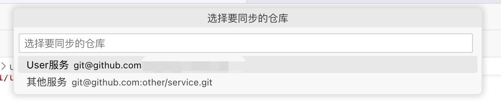
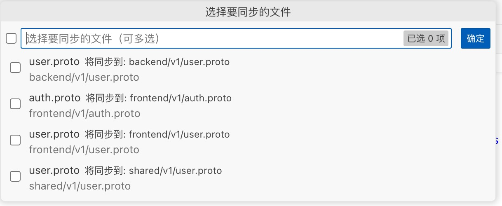
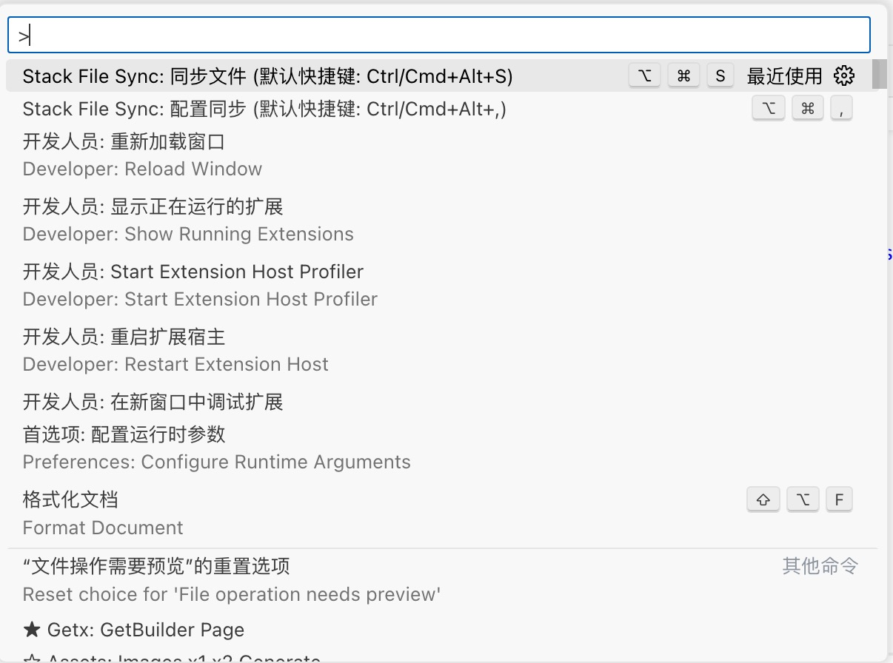
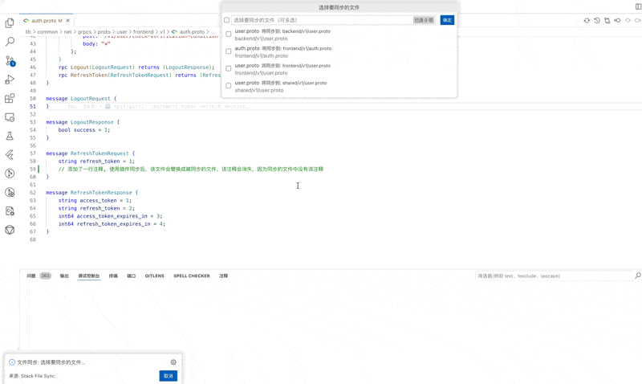

# Stack File Sync ��

[English](README_EN.md) | 简体中文

VSCode 插件用于在不同代码仓库之间同步文件。支持从多个 Git 仓库同步文件到指定目录，并提供文件备份功能。 ✨

## 功能特点 🌟

- ⚡ 支持从多个 Git 仓库同步文件
- 🎯 支持文件模式匹配（使用 glob 语法）
- 🚫 支持排除特定文件或目录
- 💾 同步前自动备份原文件
- 📁 可配置目标同步目录
- 🛠️ 支持编译后处理（如 proto 文件编译）
- 🔄 支持自动同步功能，可设置同步时间间隔
- 📝 实时同步日志显示
  - 🔄 智能自动滚动功能
  - 🎨 不同类型日志颜色区分
  - ⏰ 时间戳显示
  - 🔄 3 秒无操作自动恢复滚动

## 使用方法 📖

### 1. 配置同步设置 ⚙️

有多种方式打开配置：

- 使用快捷键 `Ctrl/Cmd + Alt + ,`
- 在命令面板中输入 "Stack File Sync: 配置同步"
- 在资源管理器中右键选择 "配置同步"

在左侧活动栏中可以看到同步日志面板，它会实时显示：

- 同步操作的进度和状态
- 文件更新的详细信息
- 命令执行的结果
- 错误和警告信息

### 3. 选择仓库



### 4. 选择文件



### 4. 执行同步

可以通过以下方式执行同步：

- 使用快捷键 `Ctrl/Cmd + Alt + S`
- 点击编辑器标题栏的同步图标
- 在命令面板中输入 "Stack File Sync: 同步文件"
- 在资源管理器中右键选择 "同步文件"

### 5. 同步流程

1. 选择要同步的仓库
2. 选择要同步的文件
3. 选择是否需要备份原文件
4. 等待同步完成
5. 执行配置的后处理命令（如果有）

### 2. 自动同步设置

可以通过以下方式配置自动同步：

1. 在左侧活动栏中点击 "Stack File Sync" 图标
2. 在仓库列表中右键点击需要自动同步的仓库
3. 选择 "启用自动同步" 或 "禁用自动同步"

启用自动同步后：

- 仓库图标会变为蓝色，表示自动同步已启用
- 仓库名称后会显示同步间隔时间
- 插件会按照设定的时间间隔自动检查并同步更新

## 使用演示

### 插件支持的命令



### 同步流程演示



## 配置项说明

### 仓库配置 (`stackFileSync.repositories`)

每个仓库可以有自己独立的配置：

```json
{
  "stackFileSync.repositories": [
    {
      "name": "用户服务",
      "url": "git@github.com:example/user-service.git",
      "branch": "main",
      "sourceDirectory": "proto/user",
      "targetDirectory": "lib/common/net/grpcs/proto/user",
      "filePatterns": ["**/*.proto"],
      "excludePatterns": ["**/backend/**"],
      "autoSync": {
        "enabled": true,
        "interval": 300
      },
      "postSyncCommands": [
        {
          "directory": "lib/common/net/grpcs/proto/user",
          "command": "protoc --dart_out=grpc:../generated *.proto"
        }
      ]
    },
    {
      "name": "订单服务",
      "url": "git@github.com:example/order-service.git",
      "branch": "develop",
      "sourceDirectory": "src/protos",
      "targetDirectory": "lib/common/net/grpcs/proto/order",
      "filePatterns": ["**/*.proto", "**/*.thrift"],
      "postSyncCommands": [
        {
          "directory": "lib/common/net/grpcs/proto/order",
          "command": "protoc --go_out=. *.proto"
        }
      ]
    }
  ]
}
```

配置项说明：

- `name`: 仓库名称，用于显示在选择列表中
- `url`: Git 仓库地址，支持 HTTPS 和 SSH 格式
- `branch`: 要同步的分支名称
- `sourceDirectory`: 要同步的源目录（相对于仓库根目录）
- `targetDirectory`: 同步文件的目标目录（支持相对或绝对路径）
- `filePatterns`: 要同步的文件模式（支持 glob 模式）
- `excludePatterns`: 要排除的文件模式（支持 glob 模式）
- `autoSync`: 自动同步配置
  - `enabled`: 是否启用自动同步
  - `interval`: 自动同步间隔（秒），默认为 300 秒（5 分钟）
- `postSyncCommands`: 同步完成后要执行的命令列表

### 备份设置 (`stackFileSync.backupEnabled`)

```json
{
  "stackFileSync.backupEnabled": true
}
```

是否在同步前自动备份原文件。

## 使用示例

### 同步 Proto 文件

```json
{
  "stackFileSync.repositories": [
    {
      "name": "用户服务",
      "url": "git@github.com:example/user-service.git",
      "branch": "main",
      "sourceDirectory": "proto/user",
      "targetDirectory": "lib/common/net/grpcs/proto/user",
      "filePatterns": ["**/*.proto"],
      "excludePatterns": ["**/backend/**"],
      "autoSync": {
        "enabled": true,
        "interval": 300
      },
      "postSyncCommands": [
        {
          "directory": "lib/common/net/grpcs/proto/user",
          "command": "protoc --dart_out=grpc:../generated *.proto"
        }
      ]
    }
  ]
}
```

### 同步多种类型文件

```json
{
  "stackFileSync.repositories": [
    {
      "name": "API 定义",
      "url": "git@github.com:example/api-definitions.git",
      "branch": "main",
      "sourceDirectory": "definitions",
      "targetDirectory": "api/specs",
      "filePatterns": ["**/*.proto", "**/*.thrift", "**/*.swagger.json"],
      "excludePatterns": ["**/tests/**", "**/examples/**"],
      "postSyncCommands": [
        {
          "directory": "api/specs",
          "command": "make generate-all"
        }
      ]
    }
  ]
}
```

## 注意事项 ⚠️

1. 确保有足够的 Git 仓库访问权限
2. 建议在同步前备份重要文件
3. 如果使用 SSH 地址，确保已配置好 SSH 密钥
4. 目标目录如果不存在会提示是否创建
5. 确保已安装后处理命令需要的工具（如 protoc、thrift 等）

## 常见问题 ❓

1. **同步失败** ❌

   - 检查 Git 仓库访问权限
   - 确认网络连接正常
   - 验证目标目录权限

2. **找不到文件** 🔍

   - 检查文件模式配置是否正确
   - 确认文件在指定分支上存在
   - 查看是否被排除模式过滤

3. **编译失败** 🚨

   - 检查后处理命令配置是否正确
   - 确保命令行工具已正确安装
   - 验证执行目录是否存在
   - 检查命令执行权限
