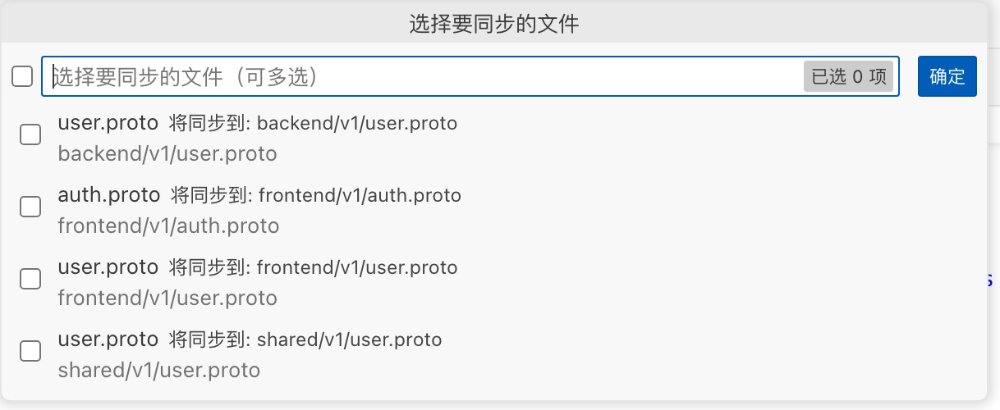
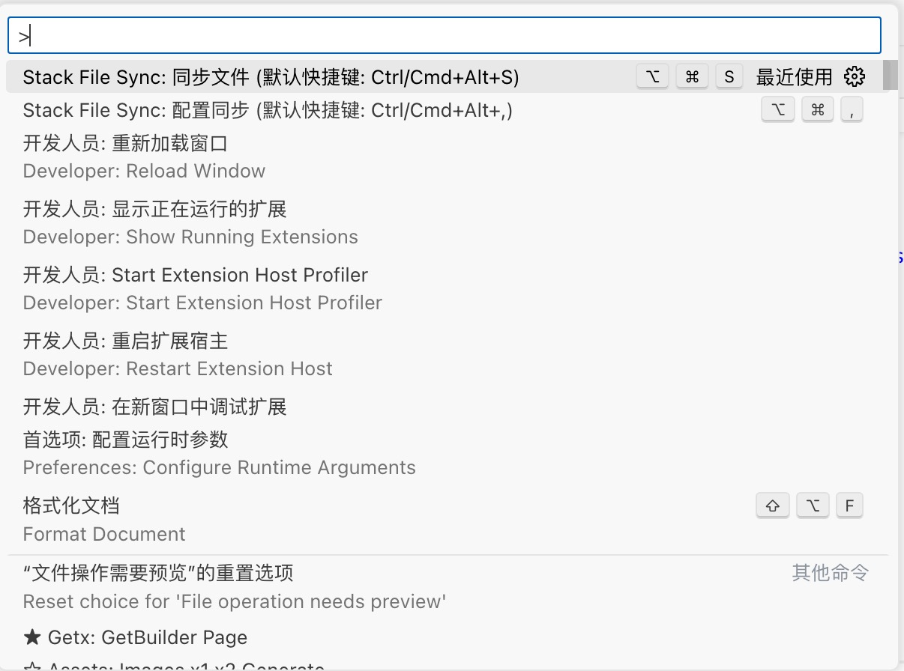

# Stack File Sync

English | [简体中文](README.md)

A VSCode extension for synchronizing files between different code repositories. Supports syncing files from multiple Git repositories to specified directories with file backup functionality.

## Features

- Support syncing files from multiple Git repositories
- Support file pattern matching (using glob syntax)
- Support excluding specific files or directories
- Automatic file backup before syncing
- Configurable target sync directory
- Support post-sync processing (e.g., proto file compilation)

## Usage

### 1. Configure Sync Settings

Multiple ways to open settings:

- Use shortcut `Ctrl/Cmd + Alt + ,`
- Type "Stack File Sync: Configure Sync" in command palette
- Right-click in explorer and select "Configure Sync"

### 2. Select Repository


### 3. Select Files



### 4. Execute Sync

You can execute sync through:

- Use shortcut `Ctrl/Cmd + Alt + S`
- Click the sync icon in editor title bar
- Type "Stack File Sync: Sync Files" in command palette
- Right-click in explorer and select "Sync Files"

### 5. Sync Process

1. Select repository to sync
2. Select files to sync
3. Choose whether to backup original files
4. Wait for sync completion
5. Execute configured post-sync commands (if any)

## Demo

### Supported Commands



### Sync Process Demo


## Configuration

### Repository Configuration (`stackFileSync.repositories`)

Each repository can have its own configuration:

```json
{
  "stackFileSync.repositories": [
    {
      "name": "User Service",
      "url": "git@github.com:example/user-service.git",
      "branch": "main",
      "sourceDirectory": "proto/user",
      "targetDirectory": "lib/common/net/grpcs/proto/user",
      "filePatterns": ["**/*.proto"],
      "excludePatterns": ["**/backend/**"],
      "postSyncCommands": [
        {
          "directory": "lib/common/net/grpcs/proto/user",
          "command": "protoc --dart_out=grpc:../generated *.proto"
        }
      ]
    },
    {
      "name": "Order Service",
      "url": "git@github.com:example/order-service.git",
      "branch": "develop",
      "sourceDirectory": "src/protos",
      "targetDirectory": "lib/common/net/grpcs/proto/order",
      "filePatterns": ["**/*.proto", "**/*.thrift"],
      "postSyncCommands": [
        {
          "directory": "lib/common/net/grpcs/proto/order",
          "command": "protoc --go_out=. *.proto"
        }
      ]
    }
  ]
}
```

Configuration items:

- `name`: Repository name, displayed in selection list
- `url`: Git repository URL, supports HTTPS and SSH formats
- `branch`: Branch name to sync from
- `sourceDirectory`: Source directory to sync (relative to repository root)
- `targetDirectory`: Target directory for synced files (supports relative or absolute paths)
- `filePatterns`: File patterns to sync (supports glob patterns)
- `excludePatterns`: File patterns to exclude (supports glob patterns)
- `postSyncCommands`: Commands to execute after sync completion

### Backup Settings (`stackFileSync.backupEnabled`)

```json
{
  "stackFileSync.backupEnabled": true
}
```

Whether to automatically backup original files before syncing.

## Examples

### Syncing Proto Files

```json
{
  "stackFileSync.repositories": [
    {
      "name": "User Service",
      "url": "git@github.com:example/user-service.git",
      "branch": "main",
      "sourceDirectory": "proto/user",
      "targetDirectory": "lib/common/net/grpcs/proto/user",
      "filePatterns": ["**/*.proto"],
      "excludePatterns": ["**/backend/**"],
      "postSyncCommands": [
        {
          "directory": "lib/common/net/grpcs/proto/user",
          "command": "protoc --dart_out=grpc:../generated *.proto"
        }
      ]
    }
  ]
}
```

### Syncing Multiple File Types

```json
{
  "stackFileSync.repositories": [
    {
      "name": "API Definitions",
      "url": "git@github.com:example/api-definitions.git",
      "branch": "main",
      "sourceDirectory": "definitions",
      "targetDirectory": "api/specs",
      "filePatterns": ["**/*.proto", "**/*.thrift", "**/*.swagger.json"],
      "excludePatterns": ["**/tests/**", "**/examples/**"],
      "postSyncCommands": [
        {
          "directory": "api/specs",
          "command": "make generate-all"
        }
      ]
    }
  ]
}
```

## Notes

1. Ensure sufficient Git repository access permissions
2. Recommend backing up important files before syncing
3. If using SSH URLs, ensure SSH keys are properly configured
4. Target directory will prompt for creation if it doesn't exist
5. Ensure required tools for post-sync commands are installed (e.g., protoc, thrift)

## FAQ

1. **Sync Failed**

   - Check Git repository access permissions
   - Verify network connection
   - Validate target directory permissions

2. **Files Not Found**

   - Check if file patterns are correctly configured
   - Confirm files exist on specified branch
   - Check if files are filtered by exclude patterns

3. **Compilation Failed**

   - Verify post-sync command configuration
   - Ensure command line tools are properly installed
   - Validate execution directory exists
   - Check command execution permissions
